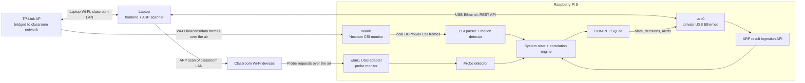

# Real CSI Backend Integration Plan

## Living Plan Rule

This document is the source of truth for the integration. Update it whenever a
test, hardware constraint, deployment decision, calibration result, or newly
discovered risk changes the intended implementation. Do not leave important
architecture decisions only in chat history.

For each material discovery:

- record what was learned;
- record the resulting decision;
- update affected implementation tasks and acceptance criteria;
- distinguish confirmed behavior from assumptions still requiring validation;
- preserve classroom-specific values as deployment configuration rather than
  hardcoded application behavior.

## Goal

Integrate the calibrated Nexmon CSI pipeline into the Signally backend, correlation engine, API, and mobile app without breaking the existing mock/demo flow or regular device monitoring.

The current-room calibration is:

- Source BSSID: `BA:A6:E6:83:23:CF`
- Channel/bandwidth: `48/80 MHz`
- Current baseline factor: `1.3`
- Typical quiet metric: approximately `0.00030-0.00034`
- Typical crossing metric: approximately `0.00060-0.00067`

These values are deployment-specific. The classroom must be recalibrated through environment configuration rather than further source edits.

## Implementation Progress

Completed in the current integration pass:

- [x] Atomic `CsiState` with real/mock mode, receiving, readiness, current and
  recent detection, metric, baseline, threshold, confidence, counters, packet
  timestamp, and last error.
- [x] Configurable CSI stale, warm-up, and detection-hold timing.
- [x] Provider-side validation of 64/128/256-subcarrier hardware frames.
- [x] Correct CSI baseline warm-up to use the median of multiple fully populated
  rolling-window metrics. Live Pi testing showed that calibrating from a partial
  window produced a threshold below the quiet-room floor and latched detection
  permanently true.
- [x] Malformed/geometry-changing frames no longer terminate the CSI thread.
- [x] Silent real-to-mock fallback removed; mock remains explicit when real CSI
  is disabled.
- [x] Probe activity removed from authoritative intruder/device counts.
- [x] CSI motion removed from authoritative intruder/device counts.
- [x] Only client probe-request frames reach probe persistence.
- [x] Authenticated laptop ARP ingestion endpoint with timestamp validation,
  replay protection, MAC/IP validation, and scanner freshness status.
- [x] Keep replay protection and scanner health in the explicitly named
  `arp_scan_tracker.py` module.
- [x] Laptop Scapy ARP agent for periodic scan submission over USB.
- [x] Preserve the original Pi-local ARP scanner by default, with
  `SIGNALLY_LOCAL_ARP_SCAN_ENABLED=false` for the classroom laptop-ingestion
  architecture so the Pi does not scan the USB subnet as if it were the room.
- [x] Additive CSI/probe/ARP health fields in system and monitoring API responses.
- [x] Real-CSI manual override protection.
- [x] Frontend CSI/probe/ARP health display and `EXPO_PUBLIC_API_URL` support.
- [x] Refresh the frontend's correlated system/CSI state every second; CSI packet
  processing remains continuous and independent of the slower ARP scan cadence.
- [x] Ensure the empty-device frontend placeholder cannot hide a CSI/probe
  `REVIEW` or `ALERT`; physical/activity evidence intentionally has no device
  record. Remove the misleading rolling probe-MAC count from the main status UI.
- [x] CSI capture script unblocks RF-kill and the service path is configurable.
- [x] Add `backend/docs/csi_backend_test_commands.md` as the consolidated Pi,
  backend, frontend, CSI, probe, and laptop-ARP test command sheet.
- [x] Add `backend/docs/correlation_flow.md` as the detailed, code-accurate guide
  covering the runtime call chain, evidence lifetimes, ordered correlation
  rules, count semantics, alert persistence, API/frontend mapping, failure
  behavior, relevant implementation files, and a function/line-level walkthrough
  of every evidence path and correlation branch, including attributed source
  excerpts for the laptop agent, backend ingestion, sensors, all nine rules,
  alert cycle, and frontend polling.
  to ARP, CSI, probing, rule priority, counts, and current policy status.
- [x] Document a Windows-only backend workflow with hardware loops disabled and
  mock CSI enabled for auth/frontend testing through the Android emulator.
- [x] Automated provider, ingestion, and probe/correlation regression tests.

Still open after this pass:

- [x] Do not add CSI calibration/reset or database-reset buttons; they are not
  required for the intended classroom workflow. Existing backend maintenance
  endpoints may remain available outside the main UI.
- [ ] Classroom RSSI, channel, BSSID, and CSI threshold calibration.
- [ ] USB gadget installation and repeated cold-boot validation on the Pi.
- [ ] Windows/Npcap validation of the laptop ARP agent on classroom Wi-Fi.
- [ ] Full Pi hardware acceptance and long false-positive soak.
- [ ] Implement Pi-initiated ARP scan requests if that remains the required
  architecture. The current laptop agent scans periodically on its own and
  pushes results to the Pi; the Pi does not currently command the laptop.

## Main-Branch Compatibility Audit — 2026-08-08

Comparison base: local `main` and `origin/main` both pointed to
`243b92fdf25494ba7092e700dc30837f7dd871f7` at audit time.

Confirmed compatible:

- [x] No route from `main` was removed. `/arp/ingest` and `/arp/status` are the
  only new routes.
- [x] No SQLAlchemy table or persisted column changed; no migration is required.
- [x] Real CSI remains opt-in. With no classroom environment configuration, the
  backend continues in explicit mock mode.
- [x] Pi-local ARP scanning remains enabled by default, preserving `main`.
- [x] Classroom external-ARP mode can disable only the Pi-local scan with
  `SIGNALLY_LOCAL_ARP_SCAN_ENABLED=false`.
- [x] `/csi/status` retains legacy `presence_detected`, `presence_strength`,
  `detected`, and `strength` fields while adding health telemetry.
- [x] Existing system-state and monitoring response fields remain; CSI, probe,
  and ARP health fields are additive.
- [x] The mobile client retains `main`'s `10.100.102.8` fallback and permits the
  classroom/USB address through `EXPO_PUBLIC_API_URL`.
- [x] The original Home/Away, blocked-device, approval, role, event, alert
  cooldown, device administration, authentication, and inspection paths remain.
- [x] Dependency integrity passes and the complete backend/frontend checks pass.

Intentional semantic corrections relative to `main`:

- CSI motion and randomized probe observations remain security evidence but no
  longer inflate `current_intruder_count` or `unknown_devices`.
- Probe-only activity can still alert in Away mode, but its count remains zero
  because it does not identify a reliable number of people/devices.
- Only actual client probe-request frames reach probe persistence; beacons,
  responses, authentication, and association management traffic are not counted
  as client probe activity.
- Real CSI stream failure is exposed as unavailable/stale instead of silently
  substituting healthy-looking mock no-motion data.
- Manual `/csi/set` remains available in mock mode and returns a conflict when
  real CSI is enabled, preventing test input from altering a live detector.

Remaining acceptance constraints, not merge regressions:

- [x] Validate Pi USB Ethernet gadget data and SSH over the laptop-to-Pi cable.
- [ ] Set and test the classroom runtime environment, including real CSI,
  external ARP mode, ingest token, interfaces, channel, bandwidth, and BSSID.
- [ ] Validate the Windows laptop agent with Npcap/admin rights.
- [ ] Perform Pi cold-boot, live CSI, ARP ingestion, probe capture, app, and alert
  end-to-end tests.
- [ ] Recalibrate and soak-test in the classroom.

## Current Risks to Address

- The backend cannot distinguish healthy CSI, warm-up, stale input, mock mode, disabled mode, or capture failure.
- Real CSI silently falls back to mock values when packets stop.
- CSI motion is currently counted as an intruder even though it is physical evidence, not a device identity.
- Some correlation branches are unreachable because generic intruder-count rules execute before CSI-specific rules.
- A short crossing may occur between 10-second monitoring cycles and never reach correlation.
- CSI provider fields are read independently across threads and may represent different frames.
- Malformed or differently sized frames can terminate the receiver thread.
- The API and app expose detection but not sensor health, baseline, threshold, or confidence.
- The mobile API URL is tied to a hardcoded DHCP address.
- CSI capture and Wi-Fi probe sniffing have different privilege requirements and must remain operationally separate.

## Target Data Flow

```text
Nexmon firmware on wlan0
    -> UDP/5500 CSI frames
    -> frame parser and validation
    -> motion detector
    -> atomic CSI state with recent-motion latch
    -> SystemStateService
    -> CorrelationService
    -> decisions and persisted alerts
    -> REST API
    -> React Native app
```

## Proposed Showcase Topology

The Raspberry Pi does not need an Ethernet connection or internet access during
the showcase. The laptop participates in two separate networks:

- Laptop Wi-Fi joins the TP-Link/classroom network and performs ARP discovery.
- Laptop USB creates a private USB-Ethernet link to the Pi for API traffic and
  ARP-result submission.

### Large plain-text view

```text
                         CLASSROOM NETWORK
                                 |
             +-------------------+-------------------+
             |                                       |
             | Ethernet                              | Wi-Fi
             v                                       v
    +-------------------+                   +-------------------+
    |   TP-LINK ACCESS  |                   |      LAPTOP       |
    |       POINT       |                   |                   |
    |                   |                   | - Runs frontend   |
    | - Bridges to the  |                   | - Performs ARP    |
    |   classroom LAN   |                   |   scans over its  |
    | - Broadcasts the  |                   |   classroom Wi-Fi |
    |   measured Wi-Fi  |                   +---------+---------+
    +---------+---------+                             |
              |                                       |
              | Wi-Fi frames over the air             | USB cable
              |                                       | Private USB network
              v                                       | ARP results + API
    +-------------------------------------------------v---------+
    |                    RASPBERRY PI 5                         |
    |                                                           |
    |  onboard wlan0                                            |
    |  +----------------------+                                 |
    |  | Nexmon CSI monitor   |                                 |
    |  | Captures TP-Link     |                                 |
    |  | radio frames         |                                 |
    |  +----------+-----------+                                 |
    |             | local UDP/5500 CSI                           |
    |             v                                              |
    |  +----------------------+                                 |
    |  | CSI motion detector  |-------+                         |
    |  +----------------------+       |                         |
    |                                 |                         |
    |  USB Wi-Fi adapter: wlan1       |                         |
    |  +----------------------+       |                         |
    |  | Probe monitor        |-------+                         |
    |  +----------------------+       |                         |
    |                                 v                         |
    |  USB gadget: usb0       +----------------------+          |
    |  +--------------------->| Correlation engine   |          |
    |  | Laptop ARP results   | + FastAPI + SQLite   |          |
    |  |                      +----------+-----------+          |
    |  +---------------------------------+                      |
    |                                    |                      |
    +------------------------------------+----------------------+
                                         |
                                         | REST responses over USB
                                         v
                                    LAPTOP FRONTEND
```

In one sentence:

```text
Laptop Wi-Fi does ARP + Pi wlan0 does CSI + Pi USB wlan1 does probing,
and the laptop exchanges ARP results/app data with the Pi over USB Ethernet.
```



Equivalent interface assignment:

| Device/interface | Responsibility |
|---|---|
| Pi `wlan0` | Continuous Nexmon CSI capture from the TP-Link radio |
| Pi `wlan1` | Continuous nearby probe-request monitoring |
| Pi `usb0` | Private laptop-to-Pi backend/API connection |
| Laptop Wi-Fi | Classroom LAN connection and ARP scanning |
| Laptop USB network adapter | ARP-result upload and frontend access to the Pi |
| Pi FastAPI backend | Authoritative state, correlation, alerts, and persistence |
| Laptop app | User interface only; it does not make security decisions |

Suggested private USB network:

```text
Pi usb0:           10.12.194.1
Laptop USB NIC:    assigned on the 10.12.194.0/28 network
Frontend API URL:  http://10.12.194.1:8000
```

Detailed evidence flow:

```text
TP-Link Wi-Fi frames
    -> Pi wlan0/Nexmon
    -> local CSI UDP frames
    -> motion detector
    -> CSI evidence --------------------+
                                         |
Nearby probe requests                    |
    -> Pi wlan1                          |
    -> probe detector                    |
    -> nearby-device evidence -----------+--> correlation engine
                                         |        |
Laptop ARP scan                          |        +--> decisions
    -> authenticated USB API request     |        +--> alerts/events
    -> normalized device observations ---+        +--> system state
                                                  |
Laptop frontend <-- USB REST API -----------------+
```

Operational constraints:

- [ ] The laptop Wi-Fi interface must be on the classroom LAN being scanned.
- [ ] The classroom network must permit enough peer visibility for ARP discovery.
- [ ] The USB link carries scan results and API traffic; it does not carry CSI.
- [ ] CSI and probe capture remain continuous and never alternate interface modes.
- [ ] The Pi must have a reliable power source independent of an underpowered
  laptop USB port if USB-C gadget mode cannot supply sufficient Pi 5 power.
- [ ] All dependencies and code must be installed before an offline showcase.
- [ ] The Pi clock must be correct so evidence timestamps can be correlated.

### Confirmed topology decisions

- [x] The Pi does not require internet access during the showcase.
- [x] The laptop joins the classroom network over Wi-Fi.
- [x] The laptop performs ARP discovery through its classroom Wi-Fi interface.
- [x] ARP results and frontend/API traffic travel over private USB Ethernet to
  the Pi; the original ARP broadcasts do not travel over USB.
- [x] Pi `wlan0` remains dedicated to Nexmon CSI.
- [x] Pi `wlan1` remains dedicated to probe monitoring.
- [x] `wlan1` will not alternate between managed and monitor modes for ARP.
- [x] The TP-Link connects to the classroom network over Ethernet in Access
  Point mode.
- [x] The Pi is the authoritative correlation and persistence node.
- [x] The laptop frontend displays Pi decisions and does not make security
  decisions itself.
- [x] CSI is captured passively over the air; the laptop-to-Pi USB path does not
  affect CSI fluidity.
- [x] CSI is intentionally used as a motion tripwire, not as continuous
  occupancy detection.
- [x] For the controlled demonstration, the backend may be launched with the
  existing root command so Scapy has raw-socket permission:
  `sudo ../.venv/bin/python -m uvicorn signally.api.app:app --host 0.0.0.0 --port 8000`.
  Privilege separation remains a post-demo hardening item rather than a blocker.
- [x] The classroom API address may be changed for the demonstration, while
  environment-driven frontend configuration remains the preferred final design.

### Risk-review decisions and resulting work

#### USB connection clarification

The Pi 5 USB gadget data connection must use its USB-C OTG-capable port. The
regular USB-A ports on the Pi are host ports and cannot be used as the laptop-to-
Pi gadget connection. A USB-A-to-USB-C data cable may connect a laptop USB-A
port to the Pi USB-C port, but the complete Pi 5 load must still be tested for
undervoltage and stability.

- [ ] Confirm the selected cable carries data, not power only.
- [x] Confirm the USB gadget interface and SSH appear over that cable.
- [ ] Confirm FastAPI is reachable over the same USB gadget address.
- [ ] Check `vcgencmd get_throttled` during CSI, probing, and backend load.

Observed hardware result:

- [x] A laptop USB-A to Pi USB-C cable successfully powers and boots the Pi 5.
- [x] Confirm the same cable is data-capable and creates the USB gadget network;
  SSH over the cable was tested successfully.
- [ ] Confirm sustained power stability under simultaneous Nexmon CSI, USB Wi-Fi
  probing, FastAPI, SQLite, and USB network traffic.

#### Laptop ARP agent and ingestion

- [x] Implement a laptop-side ARP scanner as part of this plan.
- [x] Keep it separate from UI security decisions.
- [x] Implement an authenticated Pi endpoint for normalized scan results.
- [x] Include scan ID, capture time, sender identity, MAC/IP observations, and
  scanner health.
- [x] Reject malformed, replayed, or unreasonably stale submissions.
- [x] Reserve scan IDs during processing and release them after processing
  failures so transient backend errors can be retried safely.

#### Home/Away correlation policy

Existing Home/Away behavior confirmed from the project:

- `SecurityState` already persists `HOME`/`AWAY`, `updated_at`, and
  `updated_by_role`.
- Admin and Family roles can change the mode; Guest is rejected.
- The API logs a security-mode-change event and the app already exposes the
  mode control.
- Current correlation does not ignore CSI in Home mode: CSI without an approved
  user becomes `REVIEW/LOW`; CSI with an approved user becomes `SAFE`.
- Blocked devices remain `ALERT/CRITICAL` regardless of mode.
- A mode request currently records a role supplied through the request header,
  not the authenticated identity of the individual user. This remains general
  authorization hardening, but it is not part of CSI entry correlation.

Decision: `HOME` is already the persistent relaxed-security policy. Do not add
a recent-transition window, consumable authorization, or special
`AWAY -> HOME` entry event or CSI-to-ARP grace period. In `HOME`, retain the
existing relaxed behavior: CSI-only activity is a low-severity review, approved
presence is safe, unknown connected activity is reviewed, and blocked devices
remain critical. `AWAY` means the system is armed; CSI detection while Away
must produce `ALERT/MEDIUM`, even without an ARP-identified device. CSI does not
increase `current_intruder_count` because it detects motion rather than identity.

#### CSI warm-up and health

- [ ] Define a real warm-up period using both minimum frame count and elapsed
  time; do not declare the sensor ready from time alone.
- [ ] Require a quiet calibration interval before enabling detection.
- [ ] Expose `warming_up`, `ready`, `stale`, and `failed` states through the API.
- [ ] Suppress CSI security decisions during warm-up while continuing ARP/probe
  correlation.
- [ ] Reset warm-up if the BSSID/channel/frame geometry changes or the stream is
  stale beyond a configured recovery threshold.
- [ ] Provide a visible backend/app status when the room was not quiet enough to
  establish a trustworthy baseline.

#### Detection latching and alert precautions

- [ ] Latch recent motion long enough for a monitoring cycle to consume it.
- [ ] Deduplicate multiple detector-positive frames into one entry incident.
- [ ] Retain existing alert cooldown and add an incident identifier/fingerprint.
- [ ] Prevent repeated monitoring cycles from emitting repeated alerts for the
  same crossing.
- [ ] Test two genuinely separate crossings close together.

#### Classroom items intentionally deferred

- [ ] Test classroom ARP visibility on site.
- [ ] Recalibrate BSSID, channel, bandwidth, baseline, and threshold on site.
- [ ] Confirm the college-network/AP arrangement on site.
- [ ] Tune the probe adapter to the intended college Wi-Fi channel while
  retaining monitor mode; it does not associate with the SSID in monitor mode.

#### Offline cold-start requirement

Offline readiness means more than starting online and then disconnecting. The
complete system must cold-boot and become operational with no Pi internet route.

- [ ] Boot the Pi with no internet connection.
- [x] Establish USB SSH from the laptop.
- [ ] Start or auto-start CSI capture, probing, FastAPI, and SQLite locally.
- [ ] Confirm all Python packages, Nexmon utilities, configuration, and vendor
  data are already present.
- [ ] Confirm timestamps are usable without waiting for internet NTP.
- [ ] Run the full tripwire flow from a cold offline boot.

### Showcase topology risks requiring validation

#### Pi 5 USB gadget power

The Pi 5 USB-C port is used for USB gadget mode and is normally also used for
power. A laptop port may not reliably power the Pi 5 plus the external Wi-Fi
adapter.

- [ ] Select and test a supported independent power arrangement, such as PoE+,
  or choose a different transport if reliable USB gadget power is unavailable.
- [ ] Do not assume the laptop USB port can power the full Pi setup.
- [ ] Do not use a USB-A-to-USB-A cable.

#### Classroom ARP visibility

ARP scanning may be restricted by wireless client isolation, VLAN separation,
firewall policy, sleeping devices, or randomized MAC addresses.

- [ ] Obtain permission for active discovery and for attaching the TP-Link AP.
- [ ] Test whether the laptop can discover useful peers on the actual classroom
  Wi-Fi before relying on ARP in the demonstration.
- [ ] Treat scanner freshness and visibility as explicit backend health state.

Fallback if the classroom LAN blocks discovery or does not permit a personal
access point:

- run the TP-Link as an isolated demonstration LAN with no internet uplink;
- enable its local DHCP service for the controlled demo network;
- connect the laptop and participating demonstration devices to that network;
- perform ARP discovery only against those explicitly participating devices;
- keep the Pi offline and connected to the laptop through USB as planned.

This fallback demonstrates the complete CSI/probe/ARP/correlation pipeline but
does not claim visibility into protected classroom-network clients.

#### TP-Link classroom configuration

- [ ] Confirm Access Point mode, with no competing DHCP server or NAT layer.
- [ ] Confirm the Ethernet uplink and classroom addressing work before enabling
  the demonstration.
- [ ] Confirm participating devices associate with the intended TP-Link BSSID.

#### Windows USB gadget networking

- [ ] Confirm the RNDIS driver installs and `usb0` is reachable after repeated
  Pi and laptop reboots.
- [ ] Confirm VPN or Windows route settings do not take precedence over the
  private USB network.
- [x] Confirm USB SSH access before removing Ethernet.
- [ ] Confirm FastAPI access through the USB gadget address.
- [ ] Keep the USB network from becoming the laptop's default internet route.

#### Probe coverage

A single monitor adapter cannot listen to all Wi-Fi channels simultaneously.

- [ ] Choose fixed-channel capture for a predictable showcase or explicitly
  design and test channel hopping for broader but intermittent coverage.

Current-code discovery:

- `wlan1` is explicitly removed from NetworkManager and placed in monitor mode;
  it does not currently connect through the Pi's network.
- The detector currently accepts association requests, reassociation requests,
  probe requests, probe responses, beacons, and authentication frames.
- The persistence service currently applies only an RSSI threshold; it does not
  classify client/AP direction or restrict accepted frame types.
- Beacon and probe-response transmitter MACs can therefore be misinterpreted as
  nearby client devices unless classification is corrected.
- Product intent is an unknown nearby-activity signal, not a reliable intruder
  count. The current implementation does not fully preserve that intent:
  `WifiProbingService` builds a set of observed MACs and exposes its length as
  `nearby_probe_count`; `CorrelationService` adds that value to
  `current_intruder_count`; and the API maps the resulting total to
  `unknown_devices`. This semantic mismatch must be corrected during integration.

Selected classroom policy:

- Keep `wlan1` in monitor mode continuously.
- Observe probe requests from any nearby device rather than requiring the
  device to target or associate with the college SSID.
- Use a classroom-calibrated RSSI threshold as the approximate proximity filter.
- Keep SSID/BSSID filtering optional for deployments that need AP-specific
  evidence.

Required implementation:

- [ ] Tune `wlan1` to the chosen classroom channel or implement an explicit,
  tested channel-hopping schedule.
- [ ] Accept client-originated probe requests, including wildcard and directed
  probes, when their RSSI passes the configured threshold.
- [ ] Classify client-originated versus AP-originated management frames using
  802.11 address fields and subtype semantics.
- [ ] Do not count beacons or probe responses as nearby client devices.
- [ ] Make association/authentication evidence and target SSID/BSSID filtering
  optional rather than required for the classroom tripwire.
- [ ] Calibrate RSSI inside the classroom and immediately outside each boundary;
  choose a threshold from measured overlap rather than assuming `-60 dBm`.
- [ ] Require repeated frames and/or a minimum observation count so one noisy
  RSSI sample does not create nearby activity.
- [ ] Suppress duplicate frames from the exact same temporary MAC only within a
  short processing bucket; do not attempt to link identities across MAC changes.
- [ ] Treat locally administered/randomized MACs as temporary observations and
  do not claim they are stable devices, users, or people.
- [ ] Model probe evidence primarily as an activity signal (`active`, frame rate,
  RSSI distribution, last seen) rather than a reliable nearby-device count.
- [ ] Keep unique temporary-MAC counts diagnostic only and exclude them from
  authoritative intruder counts.
- [ ] Preserve the existing product language of unknown nearby presence/activity
  while removing the current internal conversion into authoritative unknown-
  device and intruder counts.
- [ ] Expose capture channel, RSSI threshold, last-frame time, and probe health
  through backend status.

#### Offline preparation

- [ ] Install all packages and deploy all code before the offline showcase.
- [ ] Cache any manufacturer/vendor data required by the application.
- [ ] Verify the Pi clock before correlating timestamped evidence.

## Phase 1: Harden CSI Processing

Primary files:

- `backend/signally/sensors/csi_frame.py`
- `backend/signally/sensors/csi_detector.py`
- `backend/signally/sensors/csi_provider.py`
- `backend/signally/config.py`

Tasks:

- [ ] Introduce an immutable `CsiState` snapshot containing:
  - provider mode: `real`, `mock`, or `disabled`
  - receiving-data state
  - warm-up/readiness state
  - current detection
  - recent latched detection
  - motion metric
  - baseline
  - calculated threshold
  - baseline factor
  - confidence
  - frames received
  - invalid frames
  - last packet timestamp/age
  - last error
- [ ] Return the complete state atomically under a lock.
- [ ] Validate supported frame widths: 64, 128, and 256 subcarriers.
- [ ] Drop malformed frames without stopping the receiver.
- [ ] Handle an unexpected frame-width change by dropping or safely resetting detector state.
- [ ] Catch parser and detector exceptions inside the receive loop.
- [ ] Close the UDP socket reliably during shutdown and startup failure.
- [ ] Make mock mode explicit instead of silently falling back from failed real CSI.
- [ ] Preserve compatibility methods temporarily while downstream services migrate to `CsiState`.

Configuration to add or formalize:

```text
SIGNALLY_CSI_REAL_PROVIDER_ENABLED
SIGNALLY_CSI_UDP_IP
SIGNALLY_CSI_UDP_PORT
SIGNALLY_CSI_VARIANCE_WINDOW
SIGNALLY_CSI_BASELINE_FACTOR
SIGNALLY_CSI_BASELINE_WARMUP
SIGNALLY_CSI_HAMPEL_SIGMA
SIGNALLY_CSI_STALE_AFTER_SECONDS
SIGNALLY_CSI_DETECTION_HOLD_SECONDS
SIGNALLY_LOCAL_ARP_SCAN_ENABLED
SIGNALLY_ARP_INGEST_TOKEN
SIGNALLY_ARP_INGEST_MAX_AGE_SECONDS
```

Initial values:

```text
SIGNALLY_CSI_BASELINE_FACTOR=1.3
SIGNALLY_CSI_STALE_AFTER_SECONDS=3
SIGNALLY_CSI_DETECTION_HOLD_SECONDS=15
```

## Phase 2: Add Reliable Motion Latching

The detector receives approximately 10 frames per second, while correlation runs every 10 seconds. A crossing must remain visible long enough for correlation to consume it.

Tasks:

- [ ] Track `currently_detected` separately from `recently_detected`.
- [ ] Record the last detection timestamp.
- [ ] Keep `recently_detected=true` for a configurable hold period after motion ends.
- [ ] Use timestamps rather than manually clearing the latch.
- [ ] Use recent/latched motion for correlation and live motion for diagnostics.
- [ ] Confirm repeated monitoring cycles do not create uncontrolled duplicate alerts; existing cooldown rules must still apply.

## Phase 3: Correct the Correlation Model

Primary files:

- `backend/signally/models/correlation_models.py`
- `backend/signally/services/correlation_service.py`
- `backend/signally/services/system_state_service.py`

Principles:

- CSI indicates physical motion, not the identity or number of intruders.
- Unknown connected devices and nearby probes remain identity/network evidence.
- CSI health failure is unknown evidence, not proof that there is no motion.
- Blocked-device decisions retain highest priority.

Decision order:

1. Blocked connected device: `ALERT / CRITICAL`.
2. Unknown connected device:
   - HOME: `REVIEW`.
   - AWAY: `ALERT`.
   - CSI can raise severity/confidence but not device count.
3. Nearby probe activity:
   - HOME: review under existing grace rules.
   - AWAY: alert regardless of approved-device presence.
   - CSI strengthens the evidence.
4. CSI motion only:
   - HOME without approved user: `REVIEW / LOW`.
   - AWAY: `ALERT / MEDIUM` regardless of approved-device presence.
   - Approved user present: `SAFE`, with physical activity recorded.
5. CSI warming up, stale, or unavailable:
   - Continue using connected-device and probe evidence.
   - Report degraded sensor state.
6. No suspicious evidence: `SAFE`.

Tasks:

- [ ] Add CSI state/evidence to `CorrelationContext`.
- [ ] Keep `current_intruder_count` limited to actual unknown/blocked/probe-derived subjects.
- [ ] Add physical-presence and CSI-health fields separately.
- [ ] Reorder or remove unreachable correlation branches.
- [ ] Preserve HOME/AWAY, admin grace, role, and notification-audience behavior.
- [ ] Include CSI health, metric, threshold, confidence, and evidence state in alert details.

## Phase 4: Integrate System State and Alerts

Tasks:

- [ ] Have `SystemStateService` acquire one atomic CSI snapshot per cycle.
- [ ] Pass that same snapshot to correlation and response mapping.
- [ ] Use latched CSI motion for alert decisions.
- [ ] Expose current motion separately for diagnostics.
- [ ] Preserve alert cooldown behavior.
- [ ] Verify CSI-only AWAY alerts persist correctly without a device MAC.
- [ ] Avoid a database migration unless structured CSI history is explicitly required later.

## Phase 5: Extend the API Without Breaking Existing Clients

Primary files:

- `backend/signally/api/schemas.py`
- `backend/signally/api/app.py`

Tasks:

- [x] Expand `GET /csi/status` with health and detector telemetry while retaining
  the legacy detection/strength response fields.
- [ ] Add CSI telemetry to `GET /system/state`.
- [ ] Add CSI telemetry to `POST /monitoring/run-cycle`.
- [ ] Retain `csi_presence_detected` for backward compatibility.
- [ ] Keep new fields additive and give optional fields safe defaults.
- [ ] Allow `POST /csi/set` only when explicit mock/demo mode is active.
- [ ] Return a clear conflict/error if manual override is attempted while real CSI is active.

Target CSI response:

```json
{
  "provider_mode": "real",
  "receiving_data": true,
  "ready": true,
  "currently_detected": false,
  "recently_detected": true,
  "motion_metric": 0.00067,
  "baseline": 0.00034,
  "threshold": 0.000442,
  "baseline_factor": 1.3,
  "confidence": 0.51,
  "last_packet_at": "2026-08-08T00:00:00Z",
  "last_error": null
}
```

## Phase 6: Integrate the Mobile App

Primary files:

- `SignallyApp/src/api/client.ts`
- `SignallyApp/src/screens/HomeScreen.tsx`
- optional new CSI status component

Tasks:

- [ ] Extend TypeScript API types with optional CSI telemetry.
- [ ] Show compact states: online, calibrating, motion, unavailable, mock.
- [ ] Keep the correlation decision as the primary security result.
- [ ] Do not turn the entire UI into an alert based only on a raw metric.
- [ ] Put metric, baseline, threshold, and confidence in a diagnostic/developer view.
- [ ] Preserve compatibility if the backend temporarily omits new fields.
- [ ] Continue normal system-state polling at five seconds unless live animation becomes a requirement.
- [x] Replace the hardcoded backend address with `EXPO_PUBLIC_API_URL`, retaining
  `main`'s existing address as the fallback for regular development.

## Phase 7: Deployment and Service Hardening

### CSI capture service

- [ ] Add `rfkill unblock wifi` before bringing `wlan0` up.
- [ ] Ensure NetworkManager does not reclaim or retune `wlan0`.
- [ ] Remove or parameterize `/home/idanyo/Signally` in the systemd unit.
- [ ] Fail clearly when `nexutil`, `makecsiparams`, firmware, or the interface is missing.
- [ ] Persist deployment-specific BSSID, channel, bandwidth, and frame filter under `/etc/default/signally-csi`.

### Backend service

- [ ] Configure CSI and backend settings through a dedicated environment file.
- [ ] Keep the API process non-root.
- [ ] Grant Wi-Fi probing only the raw-socket capabilities it needs, or isolate probing in a privileged capture process.
- [ ] Do not run the whole FastAPI service as root merely for Scapy.
- [ ] Confirm clean startup and shutdown of CSI and Wi-Fi probing threads.

## Phase 8: Automated Tests

### Parser and detector

- [ ] Parse 20, 40, and 80 MHz frames.
- [ ] Reject invalid magic, truncated payloads, and unsupported widths.
- [ ] Handle width changes without receiver-thread death.
- [ ] Verify quiet baseline, warm-up, motion onset, recovery, and baseline adaptation.
- [ ] Verify the `1.3` threshold boundary.
- [ ] Verify recent-motion latch and expiry.

### Provider

- [ ] Synthetic UDP quiet -> moving -> quiet integration test.
- [ ] Atomic snapshot consistency.
- [ ] Stale stream detection.
- [ ] Bind failure reporting.
- [x] Malformed frames do not stop capture (automated UDP provider test).
- [x] Clean shutdown.
- [x] Explicit real, mock, and disabled modes.
- [x] No silent real-to-mock fallback.

### Correlation matrix

| Mode | Approved | Unknown | Probe | CSI | Expected |
|---|---:|---:|---:|---:|---|
| HOME | No | No | No | Yes | REVIEW/LOW |
| HOME | Yes | No | No | Yes | SAFE |
| AWAY | No | No | No | Yes | REVIEW or SAFE — confirm |
| AWAY | Yes | No | No | Yes | REVIEW or SAFE — confirm |
| AWAY | No | Yes | No | No | ALERT |
| AWAY | No | Yes | No | Yes | Higher-confidence ALERT |
| Any | Any | Blocked | Any | Any | ALERT/CRITICAL |
| Any | Any | No | No | unavailable | Network-only decision |

- [x] Verify CSI never inflates actual device counts.
- [x] Verify notification audiences remain role-aware.

### API and app

- [ ] Test `/csi/status` for real, warm-up, stale, mock, and disabled states.
- [ ] Test system state and monitoring-cycle mappings.
- [ ] Test latched motion reaches persisted alerts.
- [ ] Test backward-compatible response fields.
- [x] Run the complete backend suite: 42 tests passed on 2026-08-08.
- [x] Run frontend TypeScript validation: `tsc --noEmit` passed on 2026-08-08.

## Phase 9: Hardware Acceptance

### Current room

- [ ] Confirm AX10 source `BA:A6:E6:83:23:CF` on channel `48/80`.
- [ ] Run a 10-15 minute empty-room false-positive soak.
- [ ] Test slow, normal, and fast crossings.
- [ ] Test motion near the Pi, near the AX10, and between them.
- [ ] Confirm the API changes detection state.
- [ ] Confirm correlation produces the expected HOME/AWAY result.
- [ ] Confirm alerts appear in the app and event log.

### Classroom

- [x] Confirm real CSI capture and motion detection work in the classroom
  deployment; validated successfully during the initial classroom test.
- [x] Confirm the classroom BSSID, channel, and bandwidth for the tested AP
  setup; rediscover only if the classroom AP/configuration changes.
- [ ] Capture at least three empty/moving pairs.
- [ ] Recalculate the normalized separation.
- [ ] Override `SIGNALLY_CSI_BASELINE_FACTOR` through environment configuration.
- [ ] Test ordinary classroom noise and movement outside the intended tripwire.
- [ ] Run a longer false-positive soak.
- [ ] Document the final placement and deployment settings.

## Delivery Order

1. Harden parser, detector, and provider state.
2. Add recent-motion latching.
3. Correct correlation semantics and precedence.
4. Integrate system state and alert details.
5. Extend API schemas and mappings.
6. Add backend integration and regression tests.
7. Integrate CSI health into the app.
8. Externalize the app API address.
9. Harden systemd and privileges.
10. Run Pi end-to-end validation.
11. Repeat the merge-safety review.
12. Recalibrate and validate in the classroom.

## Acceptance Criteria

- [ ] Real, mock, disabled, warming-up, stale, and failed CSI states are distinguishable.
- [ ] Short crossings cannot be missed between monitoring cycles.
- [ ] CSI failure never appears as healthy no-motion evidence.
- [x] CSI motion does not inflate device or intruder counts.
- [ ] Correlation passes the complete HOME/AWAY evidence matrix.
- [ ] Existing mock/demo and non-CSI behavior remains functional.
- [x] The app shows correlation and CSI health without a hardcoded backend address.
- [x] Backend tests and frontend type checking pass.
- [ ] Real Pi motion changes the correlated app state and can persist an alert.
- [ ] Classroom calibration requires environment changes, not source edits.

## Approval Gate

Implementation was explicitly approved and began on 2026-08-08. Hardware and
classroom acceptance items remain gated on access to the Pi/classroom setup.
