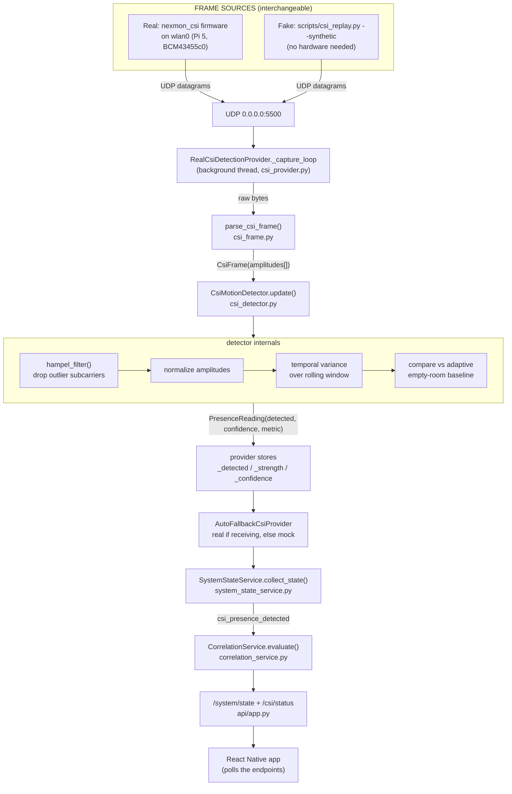
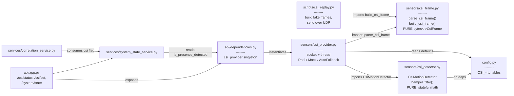
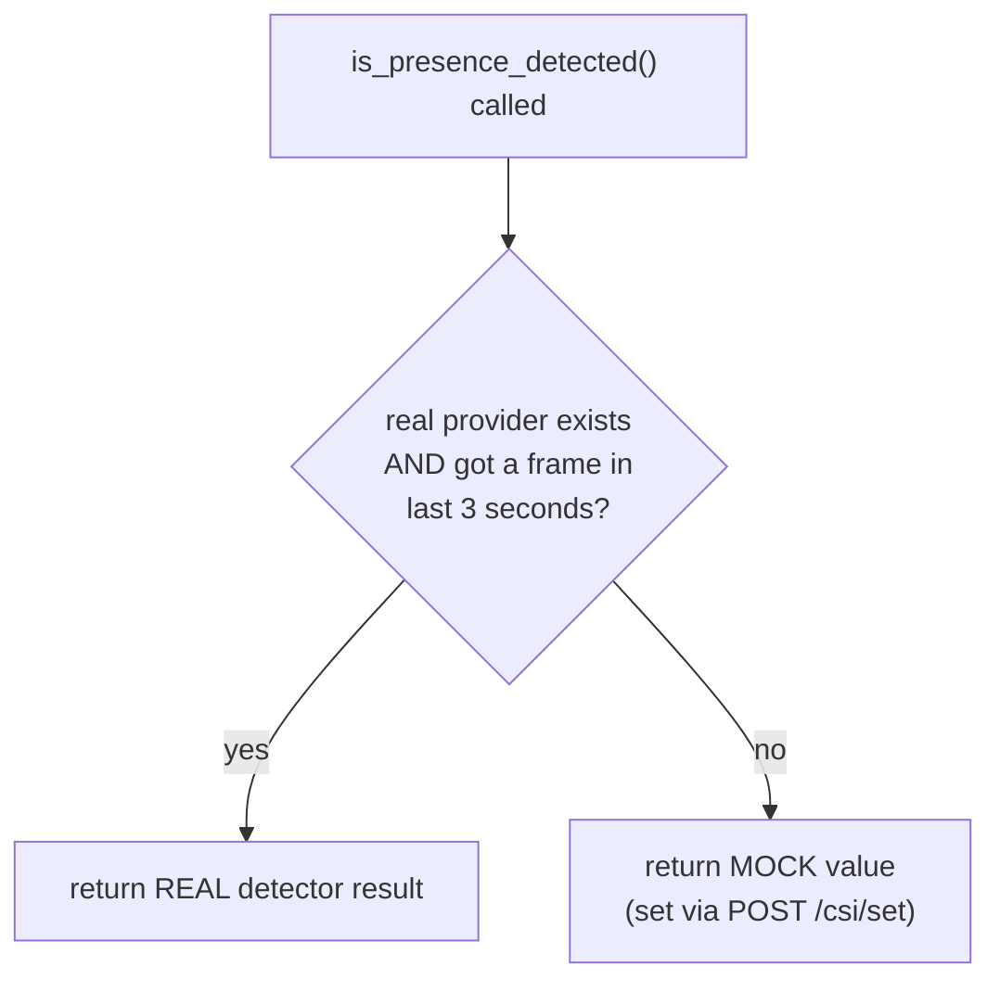
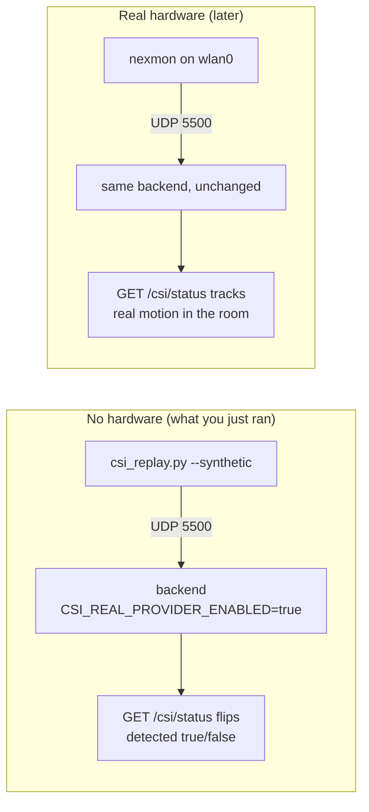

# Signally CSI Layer — Architecture & File Map

How CSI presence detection flows through the codebase, and how each file hands off
to the next. Everything below is identical whether frames come from **real nexmon
hardware** or the **synthetic replay script** — they both emit the same
nexmon-format UDP datagrams to UDP port 5500, and the software can't tell them
apart (that's why the replay is a faithful test).

## 1. End-to-end data flow



## 2. What each file does & who it calls



## 3. The three layers (why it's split this way)

The earlier version was one big threaded class that mixed sockets, byte-parsing,
and detection math — impossible to unit-test. It's now three pieces with clean
seams:

| File | Responsibility | Pure? | Tested by |
|---|---|---|---|
| `sensors/csi_frame.py` | nexmon bytes ⇄ `CsiFrame` (amplitudes) | ✅ no I/O | `tests/test_csi_frame.py` |
| `sensors/csi_detector.py` | Hampel → variance → presence + confidence | ✅ no I/O | `tests/test_csi_detector.py` |
| `sensors/csi_provider.py` | UDP socket + thread; glues the two together | ❌ has I/O | end-to-end replay |

Because the first two are pure functions/classes, they're testable with synthetic
data and never need a socket or hardware.

## 4. Real vs. mock — the fallback switch

`AutoFallbackCsiProvider` is what the rest of the app talks to. It decides per-call
whether to trust real CSI or fall back to the manual mock:



- Real provider only exists when `SIGNALLY_CSI_REAL_PROVIDER_ENABLED=true`.
- `/csi/status` returning `presence_strength: null` = no real frames arriving,
  so it's serving the mock. This is the safe default, never a crash.
- `POST /csi/set {"detected": true}` drives the **mock** — use it to test the
  HOME/AWAY correlation reaction without any CSI frames at all.

## 5. Testing paths



The move from "no hardware" to "real hardware" is literally just **swapping the
frame source** — no code changes. See `docs/nexmon_csi_setup.md` for the Pi-side
firmware steps that make box `r2` real.
```
